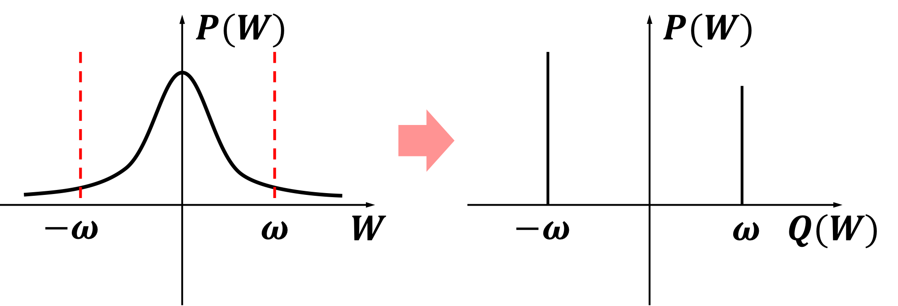
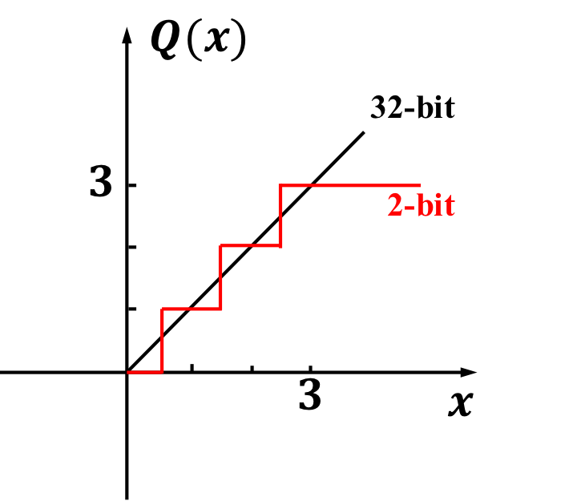

# Quantized_ResNet
This repo is an implementation of quantized CNN for both weights (1-bit compression) and feature maps (2-bit compression) using Pytorch framework. 

Deep CNNs for classification and object detection take large stoarge space and computational cost. By quantizing the weight kernel and feature maps to low-bit representation, the storage space can be decreased to a large degree. At the same time bitwise operation can be much faster than float operation. Both problems can be solved in deep CNN. 

To train a highly compressed deep CNN (1-bit convolutional kernels and 2-bit feature maps), by the script:
```
python3.6 CIFAR_MAIN.py --lr 0.1 --epoch 200 --print_freq 100 --log_file logs/log_sample.txt --quantized_layer1 2 --quantized_layer2 2 --quantized_layer3 2 --use_quantize_weight --loss_regu 0 --weight_thres 0.1
```

- [`--lr`](appconf.html#usegpu)              - (starting) learning rate, default to be 0.1
- [`--epoch`](appconf.html#usegpu)              - epochs to train, default to be 200
- [`--print_freq`](appconf.html#usegpu)              - printing frequency, default to be 10
- [`--log_file`](appconf.html#usegpu)              - log files to print
- [`--quantized_layer*`](appconf.html#usegpu)              - feature map quantization bit, default to be 2-bit
- [`--use_quantize_weight`](appconf.html#usegpu)              - enable training of quantized weights
- [`--weight_thres`](appconf.html#usegpu)              - a threshold in hysteresis loop that is applied to weight


# Weight quantization

The original weights (32-bit FloatTensor) are quantized to 1-bit representation. Moreover, by multiplying a scaling factor of full precision with kernels in each layer, the solution space involves from point space to line space. 



By adding the flag
```
--use_quantize_weight
```
to call a customized sgd optimizer, which will enable quantized weight optimization. Otherwise the weight will be updated in full precision

By adding a hysteresis loop
```
--weight_thres 0.1
```
the training can be stabilized to a large degree. The hysteresis loop for weights is shown as below:


# Feature map quantization

The original feature maps (32-bit Float Tensor) are quantized to 2-bit representation: 


By introducing PACT activation the clipping threshold applied on feature maps can be trained. More details can be found in models/resent_cifar_pact.py

# Validation accuracy (baseline)

Validation accuracy of CIFAR-10 dataset using a quantized ResNet-20 network (1-bit weights and 2-bit feature maps)


For more details please contact wxwang0104@gmail.com


